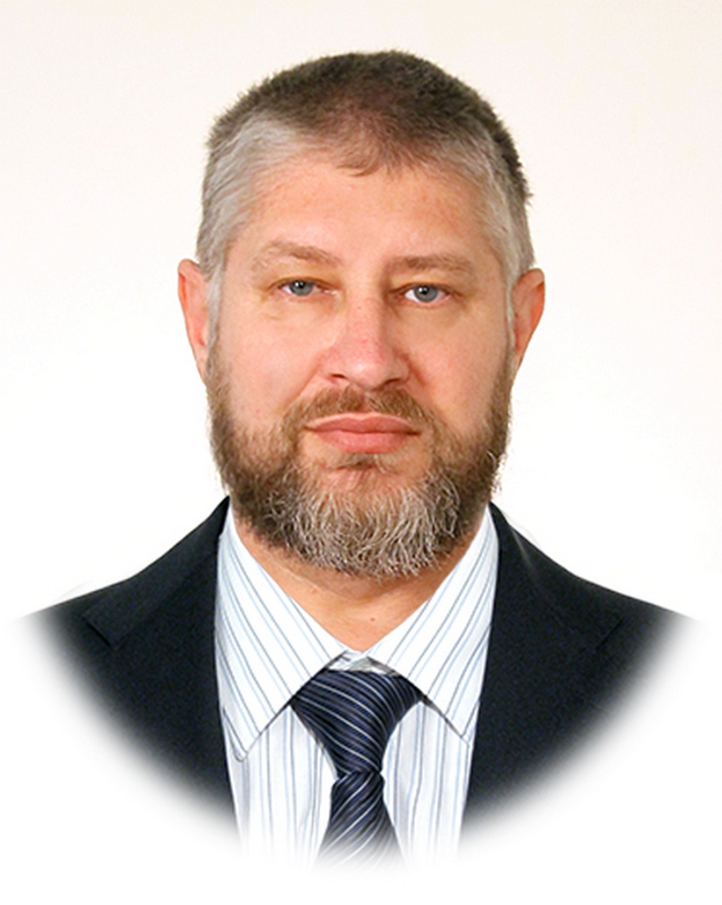
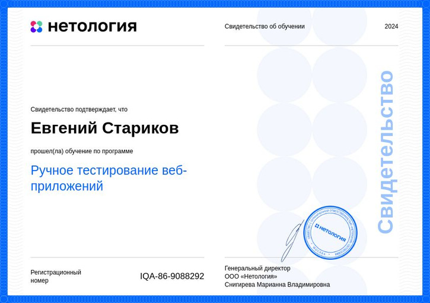

# Приветствую Вас на моей страничке!

## Меня зовут Стариков Евгений Анатольевич

***Это мой первый опыт создания портфолио, равно как и первые шаги в IT  (написание простеньких программок на бейсике в школе на ПЭВМ Искра-1030М можно в расчет не брать, - с тех пор много воды утекло).***

___

В данное время я обучаюсь на курсе тестировщиков ПО в замечательной компании Нетология, если хотите приобрести/повысить скилы или новую профессию, то 
# [Вам сюда:](https://netology.ru/referral-welcome/REF-ZJRCA1QXL)

Учиться интересно и одновременно легко и трудно: легко потому, что уже кое-какой опыт имеется (мне 53 года), а трудно потому, что порой не успеваю угнаться за безумно мчащимися трендами повседневной жизни :D

## Мои достижения

.jpg)
___

## Мои  контакты:
mailto: genestar@yandex.ru

Phone: +79537424015

ICQ: 5001376

Skype: genestar35
